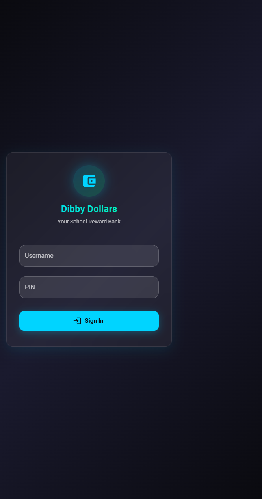
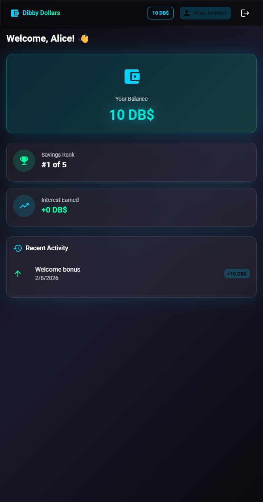
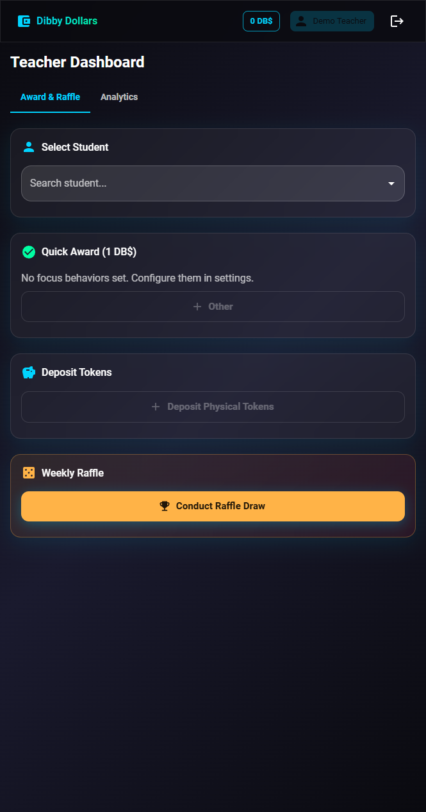
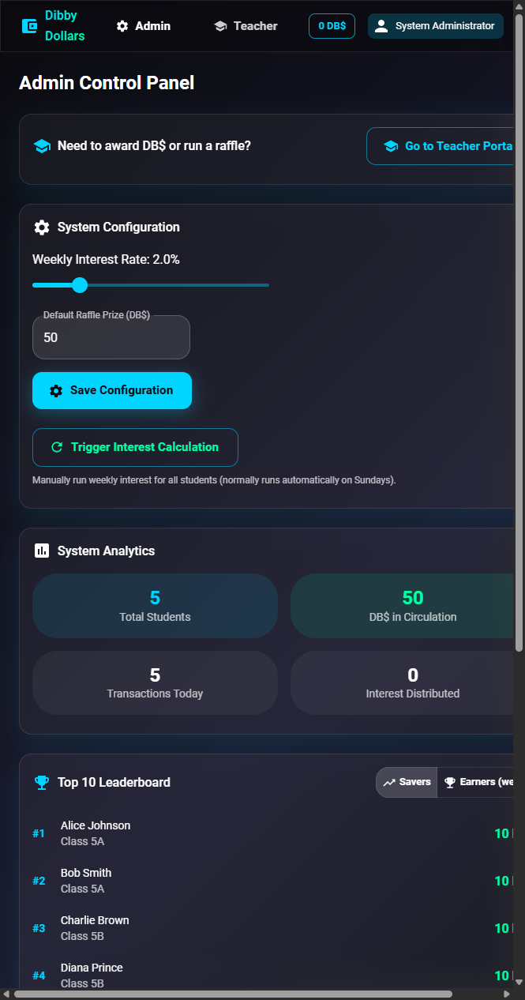

# Dibby Dollars

A school-wide reward banking web app for tracking Dibby Dollars (DB$): balances, interest, raffles, and analytics. Built for primary students with separate portals for **Students**, **Teachers**, and **Admins**.

## Screenshots

### Login Portal
<p align="center">
  
</p>

### Student Dashboard
Track your balance, view your ranking, and see your transaction history.
<p align="center">
  
</p>

### Teacher Dashboard
Award Dibby Dollars to students and conduct weekly raffles.
<p align="center">
  
</p>

### Admin Control Panel
Configure system settings, view analytics, and manage users.
<p align="center">
  
</p>

---

## What Students Can Do

Students log in with **username** and **PIN** and see only their own data:

- **View balance** – Current DB$ balance and total interest earned.
- **Savings rank** – Where they sit among all students (e.g. 3rd of 24).
- **Transaction history** – List of their own awards, deposits, interest, and raffle wins (read-only).

Students cannot award DB$, see other students’ balances, or change any system settings.

---

## What Teachers Can Do

Teachers (and admins) have access to the Teacher Dashboard and can:

- **Award DB$** – Give 1 DB$ to any student, with optional focus behavior (e.g. *Leadership*, *Teamwork*) and notes.
- **Deposit tokens** – Record physical DB$ tokens brought in by a student (any amount).
- **Manage students** – View all students (with optional class filter), add new students (name, class, PIN), and edit existing students (name, class, PIN, active status).
- **Focus behaviors** – View all behaviors, create new ones, and choose 3–5 “focus” behaviors that appear as quick-click buttons when awarding.
- **Raffles** – Run a raffle draw (random winner from all active students), set prize amount and description, and view raffle history.
- **Analytics** – View leaderboards (top savers, top earners), behavior breakdown, and system stats (total students, total DB$ in circulation, transactions today, etc.).
- **View any student’s balance and transactions** – For supporting individual students.

---

## What Admins Can Do

Admins have everything teachers have, plus the **Admin Dashboard**:

- **System configuration** – Set the **weekly interest rate** (e.g. 2%), **default raffle prize** (e.g. 50 DB$), and **interest day** (when weekly interest runs).
- **User management** – List all teachers and admins; create new **teachers** or **admins** (username, password, name, role).
- **Trigger interest** – Manually run the weekly interest calculation (e.g. for testing or catch-up).

Student accounts are created and edited by teachers via the Teacher Dashboard; admins manage only staff (teachers and admins).

---

## System Mechanics

### Weekly Interest

- **Calculation:** Interest is applied on the **minimum balance** a student held during the week (encourages saving).
- **Daily snapshot:** A background job records all balances every night at **23:55**.
- **Distribution:** Interest runs automatically every **Sunday at 23:59**. Rate is set by Admins (default 2%).

### Weekly Raffles

- Teachers run a draw; one **random winner** is chosen from all active students.
- Prize amount and description can be set per draw; Admins set the **default prize** (e.g. 50 DB$).
- Every draw is stored in **raffle history** for transparency.

### Focus Behaviors

Teachers pick 3–5 “Focus Behaviors” (e.g. *Helping Others*, *Staying On Task*, *Leadership*). These appear as one-click buttons on the Teacher Dashboard when awarding DB$.

---

## Quick Start

### Prerequisites

- Python 3.13+ and pip
- Node.js 22+ and npm
- Git

### Setup

1. **Clone and navigate:**
   ```bash
   git clone <repo-url>
   cd Dibby_Dollars
   ```

2. **Backend setup:**
   ```bash
   cd backend
   python -m venv venv
   venv\Scripts\activate   # Windows; or source venv/bin/activate on macOS/Linux
   pip install -r requirements.txt

   cp .env.example .env
   # Edit .env if needed (e.g. DATABASE_URL)

   set FLASK_APP=app.py   # or export FLASK_APP=app.py on macOS/Linux
   flask db upgrade
   python seed.py
   flask run
   ```

3. **Frontend setup** (new terminal):
   ```bash
   cd frontend
   npm install
   cp .env.example .env.local
   npm run dev
   ```

4. **Open the app** at http://localhost:5173 and log in:

   | Role    | Username       | PIN / Password |
   |---------|----------------|----------------|
   | Admin   | `admin`        | `admin123`     |
   | Teacher | `teacher`      | `teacher123`   |
   | Student | `alice.johnson`| `1111`         |
   | Student | `bob.smith`    | `2222`         |
   | Student | `charlie.brown`| `3333`         |
   | Student | `diana.prince` | `4444`         |
   | Student | `ethan.hunt`   | `5555`         |

---

## Production Deployment

- **Backend:** Run with **Gunicorn**, set `FLASK_ENV=production` and a secure `SECRET_KEY`, and use **PostgreSQL** for production. The app uses **APScheduler** for daily snapshots and weekly interest.
- **Frontend:** Build with `VITE_API_URL=https://your-domain.com/api npm run build` and serve the `dist/` folder (e.g. via Nginx).
- **Full guide:** See [notes/Dibby_Dollars_Deployment_Guide.md](notes/Dibby_Dollars_Deployment_Guide.md) and [deployment/README.md](deployment/README.md) for VPS, Nginx, HTTPS, and Certbot.

---

## Documentation

- [Backend Guide](backend/README.md) – Environment variables, migrations, scheduler.
- [Frontend Guide](frontend/README.md) – Components, state (Zustand).
- [Deployment Guide](notes/Dibby_Dollars_Deployment_Guide.md) – Hostinger VPS, Nginx, HTTPS.
- [Implementation Plan](notes/implementation_plan.md) – Original architecture.

---

## Testing

- **Backend:** `cd backend && pytest`
- **Frontend:** `cd frontend && npm run test`
- **E2E:** `cd frontend && npm run cypress:run`
