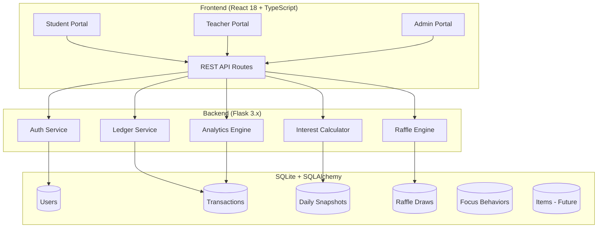
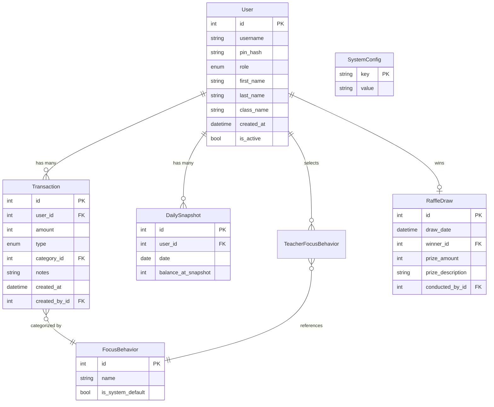

# Dibby Dollars - Implementation Plan

> A futuristic banking web app for tracking school reward currency.

## Problem Statement

Dibby Dollars (DB$) is a school-wide reward system where students earn tokens for positive behaviors. This app digitizes the "banking" aspect—tracking balances, earning interest, running raffles, and providing analytics. The system must be engaging for primary students while giving teachers powerful admin tools.

---

## User Review Required

> [!IMPORTANT]
> **Three-Tier Role System:** We're implementing Admin → Teacher → Student hierarchy. Admins control game mechanics (interest rate, raffle prize). Teachers award DB$ and run raffles. Students view their balance.

> [!IMPORTANT]
> **1 DB$ Per Award Rule:** The system enforces that behavioral awards are always exactly 1 DB$. Only raffles can award more.

> [!WARNING]
> **PIN-Based Auth (No SSO):** We're building a simple PIN/password system for student login. This is intentionally simple for primary students but means we're responsible for secure password storage (hashed).

---

## Proposed Architecture



---

## Technology Stack

| Layer | Technology | Rationale |
|-------|------------|-----------|
| **Frontend** | React 18 + TypeScript + Vite | Familiar stack from CHARLOTTE |
| **UI Library** | Material-UI v5 | Consistent with existing experience |
| **State** | Zustand + TanStack Query | Proven combo from CHARLOTTE |
| **Backend** | Flask 3.x | Lightweight, familiar |
| **ORM** | SQLAlchemy 2.x | Type-safe, migrations via Alembic |
| **Database** | SQLite | Simple local deployment |
| **Scheduler** | APScheduler | Weekly interest calculation |

---

## Proposed Changes

### Backend

---

#### [NEW] [models.py](file:///c:/Users/dsuth/Documents/Code%20Projects/Dibby_Dollars/backend/api/models.py)

SQLAlchemy models for the entire system:

```python
# Core Models
class User:
    id, username, pin_hash, role (ADMIN|TEACHER|STUDENT)
    first_name, last_name, class_name
    created_at, is_active

class Transaction:
    id, user_id, amount, type (DEPOSIT|AWARD|SPEND|INTEREST|RAFFLE)
    category_id (nullable FK to FocusBehavior)
    notes, created_at, created_by_id

class DailySnapshot:
    id, user_id, date, balance_at_snapshot
    # Used for minimum-balance interest calculation

class FocusBehavior:
    id, name, is_system_default
    # System defaults: "Helping Others", "On Task", etc.

class TeacherFocusBehavior:
    teacher_id, behavior_id, is_active
    # Junction table for teacher's selected behaviors

class RaffleDraw:
    id, draw_date, winner_id, prize_amount, prize_description
    conducted_by_id

class SystemConfig:
    key, value
    # Stores: interest_rate, raffle_prize_default

# Future-Proofed (V2)
class Item:
    id, name, price, is_available, image_url

class Purchase:
    id, user_id, item_id, amount, created_at
```

---

#### [NEW] [routes/](file:///c:/Users/dsuth/Documents/Code%20Projects/Dibby_Dollars/backend/api/routes/)

| Route File | Endpoints | Access |
|------------|-----------|--------|
| `auth.py` | `POST /auth/login`, `POST /auth/logout` | Public |
| `students.py` | `GET /students`, `POST /students`, `GET /students/:id` | Teacher+ |
| `transactions.py` | `POST /transactions/award`, `POST /transactions/deposit`, `GET /transactions` | Teacher+ |
| `balance.py` | `GET /balance/:user_id`, `GET /balance/me` | Self or Teacher+ |
| `behaviors.py` | `GET /behaviors`, `PUT /teachers/:id/behaviors` | Teacher+ |
| `raffle.py` | `POST /raffle/draw`, `GET /raffle/history` | Teacher+ |
| `analytics.py` | `GET /analytics/leaderboard`, `GET /analytics/trends` | Teacher+ |
| `admin.py` | `PUT /admin/config`, `GET /admin/config` | Admin |

---

#### [NEW] [services/interest.py](file:///c:/Users/dsuth/Documents/Code%20Projects/Dibby_Dollars/backend/api/services/interest.py)

Weekly interest calculation logic:

```python
def calculate_weekly_interest():
    """
    Runs every Sunday at 23:59.
    1. For each student, find minimum balance across all daily snapshots this week.
    2. Apply interest rate (from SystemConfig).
    3. Create INTEREST transaction.
    """
```

---

### Frontend

---

#### [NEW] [src/theme/](file:///c:/Users/dsuth/Documents/Code%20Projects/Dibby_Dollars/frontend/src/theme/)

Dark theme with Glassmorphism design tokens:

- **Background:** Near-black (`#0a0a0f`) with subtle gradient
- **Surface:** Semi-transparent (`rgba(255,255,255,0.05)`) with backdrop blur
- **Accent:** Neon cyan (`#00d4ff`) and electric teal (`#00ffa3`)
- **Typography:** Inter font family
- **Shadows:** Glow effects for cards and buttons

---

#### [NEW] [src/pages/StudentDashboard.tsx](file:///c:/Users/dsuth/Documents/Code%20Projects/Dibby_Dollars/frontend/src/pages/StudentDashboard.tsx)

Student-facing home screen:

| Component | Description |
|-----------|-------------|
| **BalanceHeroCard** | Large glassmorphic card with animated balance counter |
| **SavingsRank** | "You are #15 of 200 savers!" with progress ring |
| **InterestEarned** | "You've earned 12 DB$ in interest this term" |
| **TransactionHistory** | Scrollable list of recent transactions |

---

#### [NEW] [src/pages/TeacherDashboard.tsx](file:///c:/Users/dsuth/Documents/Code%20Projects/Dibby_Dollars/frontend/src/pages/TeacherDashboard.tsx)

Teacher portal main screen:

| Component | Description |
|-----------|-------------|
| **QuickAwardPanel** | Focus behavior buttons (3-5) + "Other" button |
| **StudentSelector** | Search/select student to award |
| **RecentAwards** | Activity feed of recent awards |
| **RaffleButton** | "Conduct Raffle Draw" action |

---

#### [NEW] [src/pages/AdminDashboard.tsx](file:///c:/Users/dsuth/Documents/Code%20Projects/Dibby_Dollars/frontend/src/pages/AdminDashboard.tsx)

Admin control panel:

| Component | Description |
|-----------|-------------|
| **InterestRateConfig** | Slider/input for weekly interest rate % |
| **RafflePrizeConfig** | Input for default raffle prize amount |
| **SystemAnalytics** | Usage stats, total DB$ in circulation |
| **UserManagement** | Add/edit teachers and admins |

---

## Database Schema



---

## Phased Delivery

| Phase | Scope | Est. Effort |
|-------|-------|-------------|
| **1. Foundation** | Project setup, DB models, auth | 1-2 sessions |
| **2. Core Banking** | Transactions, balance, deposits | 1 session |
| **3. Student Portal** | Dashboard, history, rank | 1 session |
| **4. Teacher Portal** | Awards, behaviors, raffle | 1-2 sessions |
| **5. Admin Portal** | Config, analytics | 1 session |
| **6. Polish** | Animations, testing, docs | 1 session |

---

## Verification Plan

### Automated Tests

| Test Type | Location | Command |
|-----------|----------|---------|
| Backend Unit | `backend/tests/unit/` | `pytest backend/tests/unit/` |
| Backend Integration | `backend/tests/integration/` | `pytest backend/tests/integration/` |
| Frontend Unit | `frontend/tests/` | `npm run test` |
| E2E | `frontend/cypress/e2e/` | `npx cypress run` |

### Key Test Scenarios

1. **Transaction Integrity:** Award 1 DB$ → Verify balance increases by exactly 1.
2. **Interest Calculation:** Simulate a week of varying balances → Verify interest = rate × min_balance.
3. **Raffle Draw:** Conduct draw → Verify winner's balance increases by prize amount.
4. **Auth:** Correct PIN → Login success. Wrong PIN → 401 error.
5. **Role Enforcement:** Student tries to access `/admin/config` → 403 Forbidden.

### Manual Verification

> [!NOTE]
> Manual testing will be done via browser using the dev server.

1. **Student Login Flow:** Enter student PIN → See dashboard with balance.
2. **Teacher Award Flow:** Select student → Click behavior button → Confirm award → See transaction in history.
3. **Admin Config Flow:** Change interest rate → Trigger interest calc → Verify new rate applied.
4. **Raffle Flow:** Teacher clicks "Conduct Raffle" → Enter prize description → Draw winner → Winner's balance updated.

---

## Future Considerations (V2)

- [ ] In-app spending on items/rewards
- [ ] QR code for quick student ID lookup
- [ ] Class-vs-class leaderboards
- [ ] Term-based interest reports
- [ ] CSV import/export for student bulk upload
